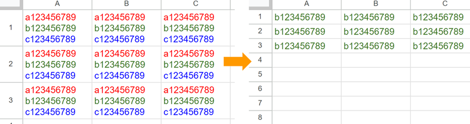

# RichTextAssistant

<a name="top"></a>
[](LICENCE)

<a name="overview"></a>

# Overview


This is a GAS library for supporting editing RichText in Google Spreadsheet using Google Apps Script.

<a name="description"></a>

## Description

There is [RichTextApp](https://github.com/tanaikech/RichTextApp) in my published libraries. RichTextApp can be used mainly for converting RichText to Google Documents and vice versa. This library RichTextAssistant will support editing the rich text in Google Spreadsheets using Google Apps Script. Google Spreadsheet can use rich text as the cell value using Google Apps Script. But, I thought that when I created a script for editing the existing rich text in the cell, it might be a bit complicated. Because, for example, in the current stage, when the text of rich text of a cell is changed using a script, all text styles are cleared. In order to add and delete a text for the rich text in a cell, it is required to create a script while the current text style is kept. This is actually complicated. From this situation, when a script for supporting editing the rich text in a cell is published, it will be useful for a lot of users. So, I created it and published it as "RichTextAssistant" of a Google Apps Script library.

## Available text styles

In the current stage, the rich text of Google Spreadsheet can use the following text styles. [Ref1](https://developers.google.com/apps-script/reference/spreadsheet/text-style-builder), [Ref2](https://developers.google.com/apps-script/reference/spreadsheet/text-style)

- Font family of the text
- Font size of the text in points
- Font color of the text
- bold
- italic
- strikethrough
- underline
- Hyperlink

## IMPORTANT

- This library uses V8 runtime. So please enable V8 at the script editor.
- Current specification for using rich text is as follows.
- RichTextValue cannot use the number value. When the cell value is a number, this cannot be retrieved by RichText. I have already reported this to [Google issue tracker](https://issuetracker.google.com/issues/158393310).
- When a cell format is set to the cell, even when the RichText is set, the existing cell format is used preferentially. So, when this library is used for such cell text, your expected result might not be able to be obtained. Please be careful about this.

# Library's project key

```
1U7E6L1c9UuZEvkO0gMVynaQskw9WUnBOcEhI5V-ojsA3ESqA0fl93dJm
```

# Methods

| Methods                                                        | Description                                                     |
| :------------------------------------------------------------- | :-------------------------------------------------------------- |
| [createNewRichText(text)](#createnewrichtext)                  | Create a new rich text including no texts and no text styles.   |
| [setTextStyleInCellText(object)](#settextstyleIncelltext)      | Set text style to a part of the cell text.                      |
| [convertRichTextToJSON(richTextValue)](#convertrichtexttojson) | Convert RichText object to JSON object.                         |
| [convertJSONToRichText(object)](#convertjsontorichtext)        | Convert JSON object to RichText object.                         |
| [deleteTexts(object)](#deletetexts)                            | Delete text with keeping the rich text.                         |
| [deleteParagraphs(object)](#deleteparagraphs)                  | Delete texts at the paragraph level with keeping the rich text. |
| [insertTexts(object)](#inserttexts)                            | Insert texts with keeping the rich text.                        |
| [insertParagraphs(object)](#insertparagraphs)                  | Insert texts at the paragraph level with keeping the rich text. |
| [appendTexts(object)](#appendtexts)                            | Append texts to existing rich text with keeping the rich text.  |

<a name="usage"></a>

# Usage:

## 1. Install library

In order to use this library, please install the library as follows.

1. Create a GAS project.

   - You can use this library for the GAS project of both the standalone type and the container-bound script type.

1. [Install this library](https://developers.google.com/apps-script/guides/libraries).

   - Library's project key is **`1U7E6L1c9UuZEvkO0gMVynaQskw9WUnBOcEhI5V-ojsA3ESqA0fl93dJm`**.

### About scopes

This library uses the scope of `https://www.googleapis.com/auth/spreadsheets`. But, this library doesn't include this scope. Because when this library is used, your client script has already used this scope.

## Methods

<a name="createnewrichtext"></a>

### `createNewRichText`

In this method, create a new rich text including no texts and no text styles.

#### Sample script

```javascript
const obj = RichTextAssistant.createNewRichText();
```

This script returns a new rich text including no texts and no text styles. You can use this object as a new canvas for editing a new rich text.

When `RichTextAssistant.createNewRichText("sample")` is run, the rich text object including a text of "sample" without the text style is returned.

<a name="settextstyleIncelltext"></a>

### `setTextStyleInCellText`

In this method, set the text style to a part of the cell text.

#### Sample script

```javascript
function sample() {
  const sheetName = "Sheet1"; // Please set sheet name.
  const searchTexts = ["sample1", "text 3", "sample5"];
  const textStyle = SpreadsheetApp.newTextStyle()
    .setBold(true)
    .setForegroundColor("red")
    .build();

  const sheet = SpreadsheetApp.getActiveSpreadsheet().getSheetByName(sheetName);
  const srcRange = sheet.getRange("A1:C3");
  const richTextValues = srcRange.getRichTextValues();
  const updatedRichTextValues = richTextValues.map((r) =>
    r.map((richTextValue) => {
      const object = {
        richText: richTextValue,
        texts: searchTexts,
        textStyle: textStyle,
      };
      return RichTextAssistant.setTextStyleInCellText(object);
    })
  );
  srcRange.setRichTextValues(updatedRichTextValues);
}
```

- About `searchTexts` in the above script, the regex can be used for searching texts. But, in that case, please use the string pattern instead of the regular expression literal. [Ref](https://developer.mozilla.org/en-US/docs/Web/JavaScript/Reference/Global_Objects/RegExp)

#### Testing


<a name="convertrichtexttojson"></a>

### `convertRichTextToJSON`

In this method, convert RichText object to JSON object. JSON object conveted with this method can be decoded to the rich text using the previous method of `convertJSONToRichText`.

#### Sample script

```javascript
function sample() {
  const sheetName = "Sheet1"; // Please set sheet name.

  const sheet = SpreadsheetApp.getActiveSpreadsheet().getSheetByName(sheetName);
  const range = sheet.getRange("A1:C3");
  const richTextValues = range.getRichTextValues();
  const res = richTextValues.map((r) =>
    r.map((richTextValue) =>
      RichTextAssistant.convertRichTextToJSON(richTextValue)
    )
  );
  console.log(res);
}
```

- When this script is run, the following value is returned.

```json
[
  [ { obj: [Object] }, { obj: [Object] }, { obj: [Object] } ],
  [ { obj: [Object] }, { obj: [Object] }, { obj: [Object] } ],
  [ { obj: [Object] }, { obj: [Object] }, { obj: [Object] } ]
]
```

<a name="convertjsontorichtext"></a>

### `convertJSONToRichText`

In this method, convert JSON object to RichText object. In this case, the source JSON object can be created by the next method of `convertRichTextToJSON`. By this conversion, for example, you can save the rich text as a text file.

#### Sample script

```javascript
function sample() {
  const sheetName = "Sheet1"; // Please set sheet name.

  const sheet = SpreadsheetApp.getActiveSpreadsheet().getSheetByName(sheetName);
  const range = sheet.getRange("A1:C3");
  const richTextValues = range.getRichTextValues();

  // Convert RichText Object to JSON object.
  const res1 = richTextValues.map((r) =>
    r.map((richTextValue) =>
      RichTextAssistant.convertRichTextToJSON(richTextValue)
    )
  );
  // console.log(res1); // You can see the JSON object in the log using this.

  // Convert JSON object to RichText Object.
  const res2 = res1.map((r) =>
    r.map((c) => RichTextAssistant.convertJSONToRichText(c))
  );
  range.offset(10, 0).setRichTextValues(res2);
}
```

- In this sample script, the rich text values of "A1:C3" are copied to "A11:C13".

- When this flow is used, you can edit `res1` and you can create a new rich text as `res2`.

<a name="deletetexts"></a>

### `deleteTexts`

In this method, delete text with keeping the rich text.

#### Sample script

```javascript
function sample() {
  const sheetName = "Sheet1"; // Please set sheet name.

  const sheet = SpreadsheetApp.getActiveSpreadsheet().getSheetByName(sheetName);
  const range = sheet.getRange("A1:C3");
  const richTextValues = range.getRichTextValues();
  const updatedRichTextValues = richTextValues.map((r) =>
    r.map((richTextValue) => {
      const object = {
        richTextValue,
        deleteIndexes: [
          { startIndex: 1, endIndex: 5 },
          { startIndex: 12, endIndex: 16 },
          { startIndex: 23, endIndex: 27 },
        ],
      };
      return RichTextAssistant.deleteTexts(object);
    })
  );
  range.setRichTextValues(updatedRichTextValues);
}
```

#### Testing


<a name="deleteparagraphs"></a>

### `deleteParagraphs`

In this method, delete texts at the paragraph level with keeping the rich text.

#### Sample script

```javascript
function sample() {
  const sheetName = "Sheet1"; // Please set sheet name.

  const sheet = SpreadsheetApp.getActiveSpreadsheet().getSheetByName(sheetName);
  const range = sheet.getRange("A1:C3");
  const richTextValues = range.getRichTextValues();
  const updatedRichTextValues = richTextValues.map((r) =>
    r.map((richTextValue) => {
      const object = { richTextValue, deleteIndexes: [0, 2] }; // 1st and 3rd paragraphs are deleted.
      return RichTextAssistant.deleteParagraphs(object);
    })
  );
  range.setRichTextValues(updatedRichTextValues);
}
```

#### Testing



<a name="inserttexts"></a>

### `insertTexts`

In this method, insert texts with keeping the rich text.

#### Sample script

```javascript
function sample() {
  const sheetName = "Sheet1"; // Please set sheet name.

  const insertIndexAsText = 1;

  // Source RichText
  const sheet = SpreadsheetApp.getActiveSpreadsheet().getSheetByName(sheetName);
  const sourceRichTextValue = sheet.getRange("C1").getRichTextValue();

  // Destination RichText
  const destinationRichTextValue = sheet.getRange("A1").getRichTextValue();

  const res = RichTextAssistant.insertTexts({
    insertIndexAsText,
    sourceRichTextValue,
    destinationRichTextValue,
  });
  sheet.getRange("E1").setRichTextValue(res);
}
```

#### Testing


<a name="insertparagraphs"></a>

### `insertParagraphs`

In this method, insert texts at the paragraph level with keeping the rich text.

#### Sample script

```javascript
function sample() {
  const sheetName = "Sheet1"; // Please set sheet name.

  const insertIndexAsParagraph = 2;

  // Source RichText
  const sheet = SpreadsheetApp.getActiveSpreadsheet().getSheetByName(sheetName);
  const sourceRichTextValue = sheet.getRange("C1").getRichTextValue();

  // Destination RichText
  const destinationRichTextValue = sheet.getRange("A1").getRichTextValue();

  const res = RichTextAssistant.insertParagraphs({
    insertIndexAsParagraph,
    sourceRichTextValue,
    destinationRichTextValue,
  });
  sheet.getRange("E1").setRichTextValue(res);
}
```

#### Testing


<a name="appendtexts"></a>

### `appendTexts`

In this method, append texts to existing rich text with keeping the rich text.

#### Sample script

```javascript
function sample() {
  const sheetName = "Sheet1"; // Please set sheet name.

  // Source RichText
  const sheet = SpreadsheetApp.getActiveSpreadsheet().getSheetByName(sheetName);
  const sourceRichTextValue = sheet.getRange("A1").getRichTextValue();

  // Destination RichText
  const appendRichTextValue = sheet.getRange("C1").getRichTextValue();

  const res = RichTextAssistant.appendTexts({
    sourceRichTextValue,
    appendRichTextValue,
  });
  sheet.getRange("E1").setRichTextValue(res);
}
```

- sourceRichTextValue: Source RichTextValue. This rich text is inserted to the destination rich text.
- appendRichTextValue: This rich text is appended to sourceRichTextValue.
- lastLineBreak: When this is true, when a text is appended, the line break is appended to the existing text and append the text. When you want to append a text as a paragraph, true is useful. Default value is true.

#### Testing


## Limitations

As a limitation, in the current stage, the lists and images cannot be used with the rich text of Google Spreadsheet. So please use only the texts with the text style.

---

<a name="licence"></a>

# Licence

[MIT](LICENCE)

<a name="author"></a>

# Author

[Tanaike](https://tanaikech.github.io/about/)

[Donate](https://tanaikech.github.io/donate/)

<a name="updatehistory"></a>

# Update History

- v1.0.0 (April 2, 2023)

  1. Initial release.

[TOP](#top)
